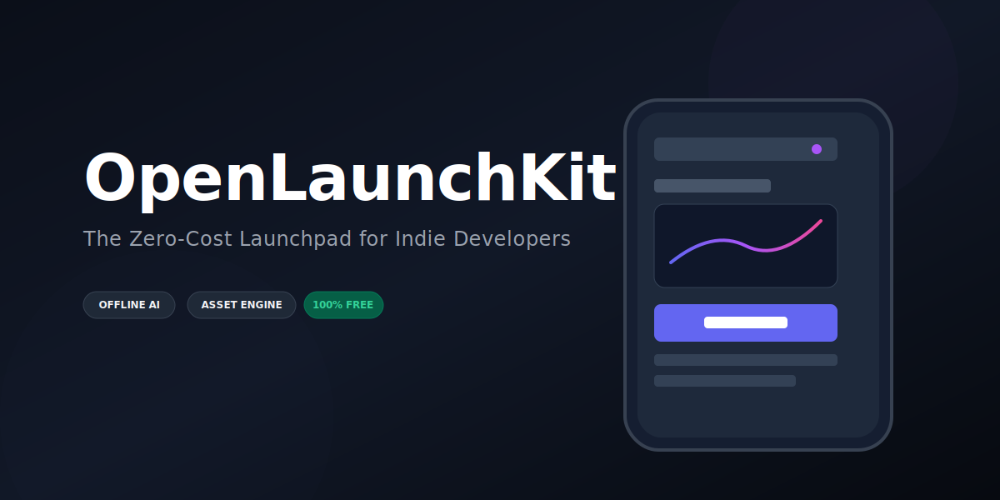

  

# OpenLaunchKit 🚀

A free, open-source, local-first toolkit designed to help indie developers handle App Store Optimization (ASO), promotional mockups, and release notes without spending money on expensive subscriptions.

## Features
- **Local AI ASO:** Uses Ollama to generate app descriptions without paid APIs.
- **UPDATE - Hybrid AI Engine:** Added fallback support for the free Google Gemini API and a native zero-dependency Offline Analyzer. It works instantly for everyone, even without an AI setup!
- **Mockup Generator:** Wraps raw screenshots into professional device frames automatically.
- **UPDATE - Smart Bezel Rendering:** Automatically scales viewport screenshots and programmatically renders a premium dark-mode smartphone bezel around them.
- **Automated Changelogs:** Converts Git commit history into user-friendly release notes.

## Installation
1. Clone the repository: `git clone https://github.com/yourusername/OpenLaunchKit.git`
2. Install dependencies: `pip install -r requirements.txt`
3. Run the app: `streamlit run app.py`

*(Note: For the ASO features to work, ensure you have Ollama installed and running locally with a model like Llama3).*

## Usage & Configuration Updates
- **Zero Setup Required:** You no longer *must* have Ollama installed. The app will gracefully fall back to an offline Python word-frequency analyzer if no local AI is detected.
- **Optional Cloud AI:** In the app's sidebar, you can optionally paste a free Gemini API key to run advanced cloud queries without downloading massive local models to your computer.
